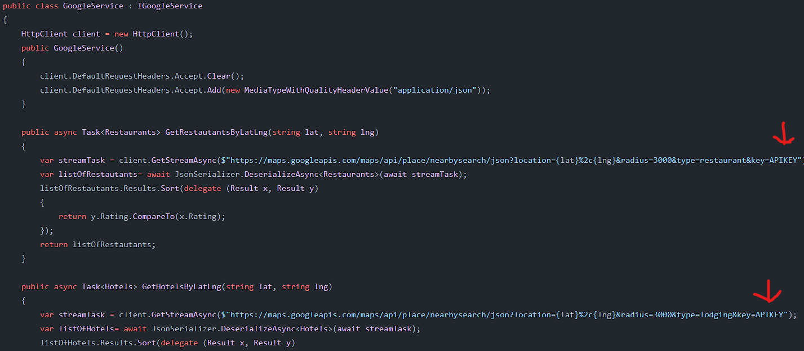

# This document will cover an overview of how the project is structured as well as give API key information

### First for the project to run correctly you will need to add the following API keys to the files listed below:
- We used the AeroDataBox API to pull flight data.
- To get the data you will need to add the following API key to **./backend/src/Services/FlightService.cs** to the location shown below

```console
AeroDataBox API Key:
Your Api Key
```


- We are also using google's API to pull hotel and restaurant data
- To get the data you will need to add the following API key to **./backend/src/Services/GoogleService.cs** to the **two** locations shows below by replacing the text "APIKEY" with the following key

```console
Google API Key:
Your Api Key
```



### Project Structure
The Project has a backend built with C# and a frontend build with nodeJS. Below is a high level overview of how the project is working

- Client: The Frontend
    - pages: 
        - index.js: the homepage has the form that gives the search criteria to the [date].js page.
        - [date].js: calls the components and services to display the results of the search. The services call the backend to get the flight and location information.
    - components: The [date].js page uses the components to build the page and display the results of the search.
    - services: makes calls to the backend to get the results of calls to the APIs
    - __test__: tests using Jest to make sure the frontend is building and displaying results as expected.
- Backend:
    - src:
        - Services: The services make calls to the AeroDataBox API and the google API to get the results we need. There is one for the flight informationm, the hotel information, and the restaurant information.
        - Models: These are the models for parsing the JSON information received from the API calls made.
        - Controllers: These are the controllers that handle HTTP requests recevied to our API
            - ArrivalFlightsControllers: the API can be called by giving the toLocal, fromLocal, and icao as shown in the code comment
            - FlightsController: the API can be called by giving the flightNumber and Date as shown in the code comment
            - HotelController: the API can be called by giving the lattitude and Longitute as shown in the code comment
            - RestautantsController: the API can be called by giving the lattitude and Longitute as shown in the code comment
